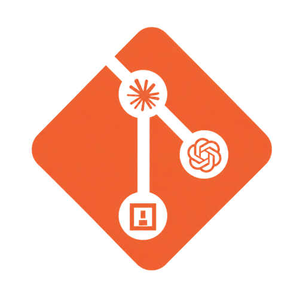

<p align="center">
  
</p>

# git-agent-sync

[English](README.md) | [中文](README.zh-CN.md)

`git-agent-sync` 是一个 Git 风格的 AI 编程会话同步工具。

它解决一个很具体的问题：**业务代码可以通过 `git clone` 到另一台机器，但 Codex、Claude Code 这类 code agent 的本地会话通常不会跟过去。**

> Git for your AI coding sessions.

## 当前能力

- 作为 Git 子命令使用：`git agent-sync ...`
- 通过结构化元数据发现当前项目的 Codex / Claude Code session 文件
- 默认跳过 Codex 已归档会话，以及 agent 的全局配置、账号、缓存、运行态文件
- 把匹配到的会话复制到 sidecar Git 仓库 `.agent-sync-store/`
- 支持把 sidecar 仓库推送到专门的私有远程仓库，不污染业务仓库提交
- 支持在另一台机器拉取 sidecar 仓库并恢复 Codex / Claude Code 会话
- 支持跨机器、跨操作系统恢复时做项目路径适配
- 为每次会话快照记录业务项目 branch、`HEAD` commit、dirty 状态和同步说明
- 支持按 latest/current/branch/commit/bundle id/log index 浏览和恢复会话
- 提供 React Ink TUI，集中处理 Dashboard、同步队列、会话历史、本机 provider、工具转换、隐私 review、冲突检查和设置流程

## 安装

CLI 包已经发布到 npm：

```bash
npm install -g git-agent-sync
```

VS Code 插件已经发布到 Marketplace：

- Marketplace：[Git Agent Sync](https://marketplace.visualstudio.com/items?itemName=mokio.agent-sync-vscode)
- 扩展 ID：`mokio.agent-sync-vscode`

本地开发阶段：

```bash
cd ~/Agent-Sync
npm install
npm link
git agent-sync --help
```

## 基础使用

先创建一个专门保存 agent 会话的私有仓库，例如：

```text
git@github.com:yourname/agent-session-store.git
```

不要直接把会话存进业务代码仓库。会话里可能包含私有代码、API key、终端输出、本地路径、prompt 和调试信息。

在已有会话的机器上：

```bash
cd your-project
git agent-sync init --remote git@github.com:yourname/agent-session-store.git
git agent-sync status
git agent-sync push
```

如果 sidecar remote 已经有 `main` 分支，并且当前项目的本地 `.agent-sync-store/` 还没有提交，`init` 会自动 checkout 这段远程历史。新项目初始化后可以直接 `push`。

在另一台机器上：

```bash
git clone git@github.com:yourname/your-project.git
cd your-project
git agent-sync init --remote git@github.com:yourname/agent-session-store.git
git agent-sync pull
git agent-sync log --latest
git agent-sync restore --latest 1
```

在业务仓库 `git push` 前自动同步：

```bash
git agent-sync install-hooks
git push
```

hook 会把同步任务放入后台队列，而不是在 `git push` 过程中直接执行 sidecar push。也可以手动管理队列：

```bash
git agent-sync sync --background
git agent-sync sync status
git agent-sync sync --flush
git agent-sync daemon start
git agent-sync daemon status
git agent-sync daemon stop
```

移除 hook：

```bash
git agent-sync uninstall-hooks
```

## 基本原理

Agent-Sync 把 agent 会话当作“贴着 Git 项目走的本地资料”，而不是业务源码。它在业务项目里保存本机配置 `.agent-sync/`，并使用独立的 sidecar Git 仓库 `.agent-sync-store/` 保存会话快照。

项目归属判断很保守。Codex 会话优先使用 Codex state 和 JSONL 里的 `cwd`、Git remote、branch、commit、`rollout_path` 等结构化信息。Claude Code 会话使用 JSONL 的 `cwd`、Git 字段，以及 tool-use input 里的 `cwd` / `workdir`。正文里提到项目名，不会被当作归属证明。

每次 `push` 会把通过校验的 session 文件复制到 sidecar store，并追加一条 Git context binding，记录业务仓库当时的 branch、`HEAD` commit、dirty 状态、bundle id、会话标题和同步说明。`pull` 拉取 sidecar store，`restore` 再把选中的会话写回当前机器的 Codex / Claude Code 会话目录，并在需要时适配源机器路径。如果事件重放发现同一个 agent session id 对应多个对象 hash，Agent-Sync 会写入非破坏性的冲突隔离记录，可以用 `conflicts` 查看并标记解决。切换 Codex API 来源时，`clone-local` 和 `watch-local` 可以不经过 sidecar remote，把当前项目的 Codex 会话克隆到当前 `model_provider`。

完整设计细节见：[概念说明](docs/concepts.zh-CN.md) 和 [工具执行链路](docs/execution-flow.zh-CN.md)。

## 命令表

| 命令 | 用途 |
| --- | --- |
| `git agent-sync init [--remote <url>\|<url>] [--store <path>]` | 初始化本地配置和 sidecar store |
| `git agent-sync status [--json]` | 查看当前项目同步状态 |
| `git agent-sync scan [--json]` | 扫描匹配当前项目的 Codex / Claude session |
| `git agent-sync push [--m <message>]` | 写入会话快照并推送 sidecar remote |
| `git agent-sync pull` | 拉取当前项目可用的 sidecar 快照 |
| `git agent-sync sync --background` | 入队 sidecar 同步任务并启动后台 worker |
| `git agent-sync sync status` | 查看 pending、running、done、failed 同步任务 |
| `git agent-sync sync --flush` | 在当前终端处理队列中的同步任务 |
| `git agent-sync daemon <start\|status\|stop>` | 管理本地后台同步 worker |
| `git agent-sync privacy scan` | 扫描当前项目会话里的常见密钥 |
| `git agent-sync push --privacy redact` | 命中密钥时写入脱敏后的 sidecar 副本 |
| `git agent-sync conflicts list` | 列出 active 的 sidecar 冲突隔离记录 |
| `git agent-sync conflicts show <id\|index>` | 查看某条隔离冲突的对象和事件详情 |
| `git agent-sync conflicts resolve <id\|index> --strategy keep-all` | 在不删除任一对象的前提下标记冲突已解决 |
| `git agent-sync tool inspect --session <bundle-id>` | 用 Conversation IR 汇总一个 sidecar bundle |
| `git agent-sync tool convert --session <bundle-id> --to ir` | 把 Codex 或 Claude bundle 转成 Agent-Sync Conversation IR |
| `git agent-sync tool export --session <bundle-id> --to <codex\|claude> --mode readable` | 从 IR 导出可阅读的跨工具 JSONL |
| `git agent-sync clone-local [target-provider]` | 把本机当前项目的 Codex 会话克隆到指定或当前 Codex `model_provider` |
| `git agent-sync watch-local [--interval <seconds>]` | 监视 Codex `model_provider` 变化，并自动克隆到当前 provider |
| `git agent-sync register-local` | 把 Agent-Sync 本机 provider 克隆注册进本机 Codex UI 索引 |
| `git agent-sync repair-local` | 修复本机 Codex provider 克隆会话的 UI 注册 |
| `git agent-sync tui` | 打开交互式终端菜单，集中执行常用 Agent-Sync 操作 |
| `git agent-sync log [--oneline] [-n <count>\|-<count>] [--json]` | 浏览可恢复会话历史 |
| `git agent-sync log --latest [--oneline] [-n <count>\|-<count>] [--json]` | 浏览最近一次同步批次 |
| `git agent-sync log --current [--json]` | 浏览当前业务 commit 对应会话 |
| `git agent-sync log --branch <name> [--json]` | 浏览某个历史 branch 标签下的会话 |
| `git agent-sync log --commit <sha> [--json]` | 浏览某个业务 commit 对应会话 |
| `git agent-sync show <bundle-id>` | 查看一个快照 bundle |
| `git agent-sync show --latest 1` | 查看 latest selector 输出中的某条会话 |
| `git agent-sync show --current 1` | 查看 current selector 输出中的某条会话 |
| `git agent-sync restore <bundle-id>` | 直接恢复一个 bundle |
| `git agent-sync restore --index <n>` / `--i <n>` | 按默认 log 编号恢复 |
| `git agent-sync restore --all` | 恢复全部匹配会话 |
| `git agent-sync restore --latest [n]` | 恢复最近同步批次，或其中一条 |
| `git agent-sync restore --current [n]` | 恢复当前 commit 对应会话，或其中一条 |
| `git agent-sync restore --branch <name> [n]` | 恢复某个历史 branch 标签下的会话 |
| `git agent-sync restore --commit <sha> [n]` | 恢复某个业务 commit 对应会话 |
| `git agent-sync restore --current --no-adapt` | 不做本机路径适配，按 sidecar 原文件恢复 |
| `git agent-sync restore --current --no-register` | 恢复文件但不写入 Codex UI 索引 |
| `git agent-sync install-hooks` | 安装 pre-push hook |
| `git agent-sync uninstall-hooks` | 移除 pre-push hook |
| `git agent-sync doctor` | 检查项目、配置、sidecar store、远程、manifest、bindings 和会话目录 |

## 文档导航

- [文档首页](docs/README.zh-CN.md)
- [使用指南](docs/usage.zh-CN.md)
- [概念说明](docs/concepts.zh-CN.md)
- [工具执行链路](docs/execution-flow.zh-CN.md)
- [开发说明](docs/development.zh-CN.md)
- [发布与发版指南](docs/publishing.zh-CN.md)
- [VS Code 插件](extensions/vscode/README.md)

## 隐私提醒

当前 `push` 默认使用 `--privacy review`，扫描到常见密钥时会阻止推送；可以用 `git agent-sync privacy scan` 查看命中项，或用 `git agent-sync push --privacy redact` 写入脱敏后的 sidecar 副本。项目会话仍可能包含私有代码、本地路径、prompt、终端输出和调试信息。Agent-Sync 不会复制 Claude 账号、token、全局配置、缓存、遥测、插件、技能、IDE lock 或运行态 session 文件。

请务必使用私有远程仓库保存 sidecar session store。后续生产化版本应加入默认加密和 secret redaction。
